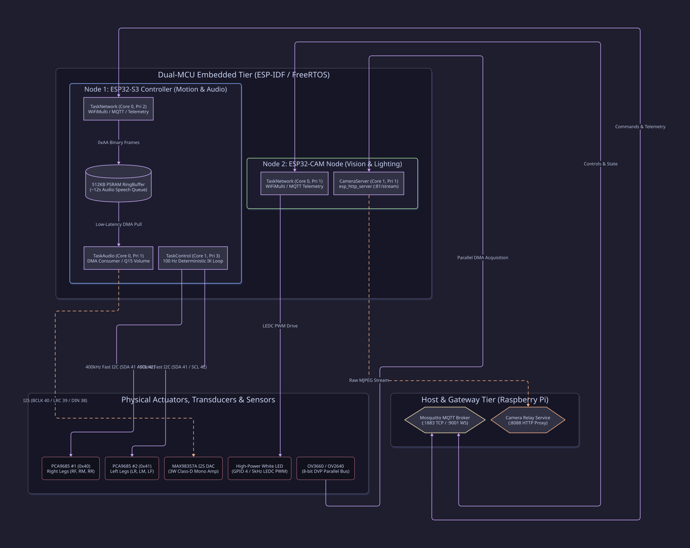
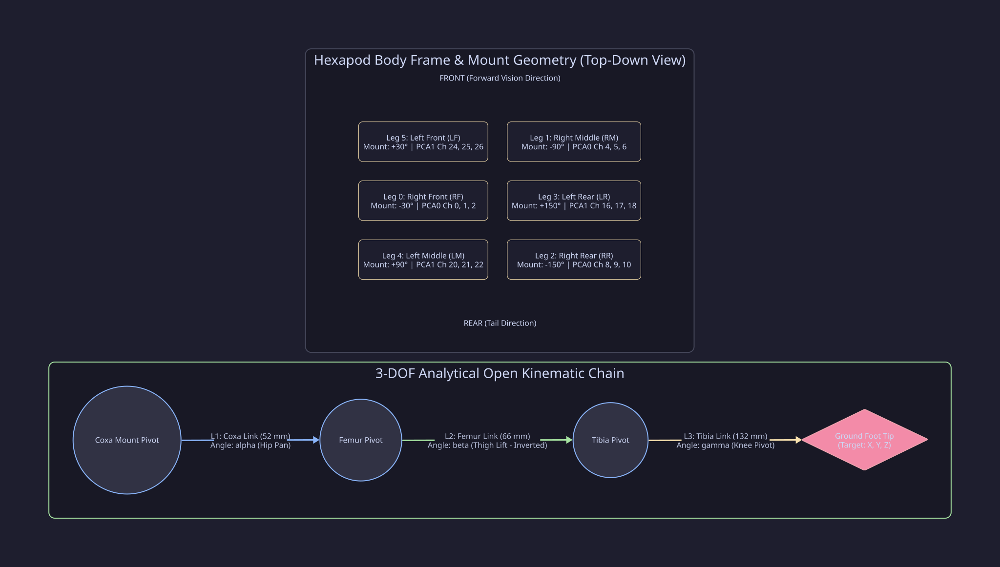
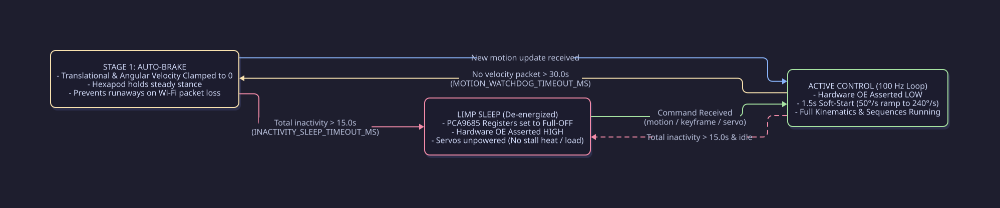
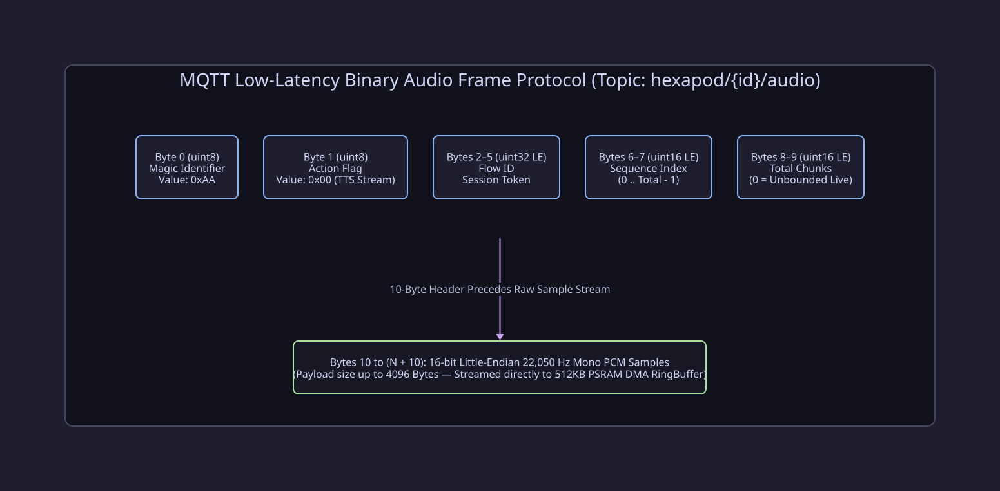
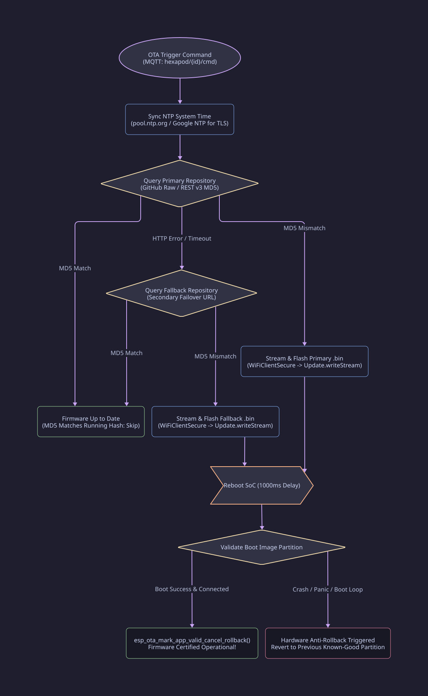

Here is the complete solution:
1. **Fixed Mathematical Formulas** (replaced `\operatorname` with standard GitHub KaTeX `\text` macros).
2. **Unified D2 Scripts for ALL 7 diagrams** (including the Binary Audio Frame and Hardware Timing diagrams, so you can generate every single SVG from the single **[play.d2lang.com](https://play.d2lang.com)** editor).
3. **The full corrected `README.md`** formatted directly below.

---

# Hexapod V2 — Dual-Node Embedded Firmware

[](https://platformio.org/)
[](https://github.com/espressif/arduino-esp32)
[](https://www.freertos.org/)
[](https://www.espressif.com/)
[](LICENSE)

The **Hexapod V2 Firmware** repository contains the embedded software powering the dual-microcontroller architecture of the Hexapod V2 robotics platform. Built with C++17 on FreeRTOS and the ESP-IDF/Arduino framework, the firmware decouples high-frequency deterministic motion control and low-latency digital audio from vision capture and remote telemetry across two cooperative ESP32 SoC nodes.

---

## Table of Contents

- [System Architecture](#system-architecture)
  - [Hardware Tier & Dual-Node Topology](#hardware-tier--dual-node-topology)
  - [FreeRTOS Task & Multi-Core Distribution](#freertos-task--multi-core-distribution)
- [Firmware Node Projects](#firmware-node-projects)
  - [1. `s3-main` (ESP32-S3 Control & Streaming Audio Node)](#1-s3-main-esp32-s3-control--streaming-audio-node)
  - [2. `cam-main` (ESP32-CAM Vision & Illumination Node)](#2-cam-main-esp32-cam-vision--illumination-node)
- [Hardware Pinout & Mapping Tables](#hardware-pinout--mapping-tables)
  - [ESP32-S3 Hardware Pin Map](#esp32-s3-hardware-pin-map)
  - [ESP32-CAM Hardware Pin Map](#esp32-cam-hardware-pin-map)
  - [Dual PCA9685 18-Servo Channel Allocation](#dual-pca9685-18-servo-channel-allocation)
- [Kinematics & Motion Control Subsystem](#kinematics--motion-control-subsystem)
  - [3-DOF Analytical Inverse Kinematics](#3-dof-analytical-inverse-kinematics)
  - [6-DOF Body Pose & Coordinate Transformation](#6-dof-body-pose--coordinate-transformation)
  - [Omnidirectional Gait Engine](#omnidirectional-gait-engine)
  - [Dynamic Multi-Keyframe Sequencer & Easing](#dynamic-multi-keyframe-sequencer--easing)
  - [Two-Stage Safety Watchdog & Soft-Start Protection](#two-stage-safety-watchdog--soft-start-protection)
- [Audio & Vision Streaming Subsystems](#audio--vision-streaming-subsystems)
  - [Low-Latency Binary Audio Stream Pipeline](#low-latency-binary-audio-stream-pipeline)
  - [MJPEG Stream Server & Dynamic Camera Tuning](#mjpeg-stream-server--dynamic-camera-tuning)
- [Directory Structure](#directory-structure)
- [MQTT Communication Protocol](#mqtt-communication-protocol)
  - [Command Payloads (`hexapod/{id}/cmd`)](#command-payloads-hexapodidcmd)
  - [Camera Dynamic Configuration (`hexapod/{cam_id}/cmd`)](#camera-dynamic-configuration-hexapodcam_idcmd)
  - [Telemetry Payloads (`hexapod/{id}/telemetry`)](#telemetry-payloads-hexapodidtelemetry)
- [Building, Flashing & OTA Updates](#building-flashing--ota-updates)
  - [PlatformIO Compilation](#platformio-compilation)
  - [Dual-Repository Failover OTA Deployment](#dual-repository-failover-ota-deployment)
- [Simulation & Wokwi CI Testing](#simulation--wokwi-ci-testing)
- [License](#license)

---

## System Architecture

### Hardware Tier & Dual-Node Topology

The robotics platform divides processing across an **ESP32-S3-DevKitC-1** (responsible for real-time kinematics, servo driving, and I2S audio playback) and an **AI-Thinker ESP32-CAM** (dedicated to video acquisition and lighting). Both nodes independently discover network endpoints and the Pi-Hub MQTT broker via mDNS.



---

### FreeRTOS Task & Multi-Core Distribution

To guarantee jitter-free 100 Hz kinematic execution while sustaining high-throughput network and audio pipelines, operations are partitioned across the Xtensa dual cores:



- **ESP32-S3 Core 0:**
  - `TaskNetwork` (Priority 2, 8KB stack): Manages `WiFiMulti` failover, MQTT communication, retained config handshakes, non-blocking log sink draining, and binary audio frame ingestion.
  - `TaskAudio` (Priority 1, 8KB stack): Real-time I2S DMA consumer. Reads PCM samples from a 512KB PSRAM `RingBuffer`, applies Q15 volume scaling, and outputs to the MAX98357A amplifier.
- **ESP32-S3 Core 1:**
  - `TaskControl` (Priority 3, 4KB stack): 100% dedicated 100 Hz motion loop. Runs 3-DOF IK calculations, 6-DOF body transformations, dynamic keyframe interpolation, and synchronized dual-PCA9685 I2C burst transactions via `vTaskDelayUntil`.
- **ESP32-CAM Core 0 & Core 1:**
  - `TaskNetwork` (Core 0, Priority 1, 8KB stack): Handles Wi-Fi, MQTT state sync, and periodic telemetry.
  - `CameraServer` (Core 1, 8KB stack): Runs the non-blocking `esp_http_server` daemon streaming JPEG frames at port 81 (`/stream`).

---

## Firmware Node Projects

### 1. `s3-main` (ESP32-S3 Control & Streaming Audio Node)
- **Target Microcontroller:** ESP32-S3 (ESP32-S3-DevKitC-1-N16R8, 16MB Flash, 8MB Octal PSRAM).
- **Core Responsibilities:**
  - Analytical 3-DOF Inverse Kinematics for all 18 hexapod leg joints.
  - 6-DOF body translation and rotational pose orientation matrix ($R^T$).
  - Omnidirectional locomotion (Tripod, Ripple, Wave gaits) with dynamic stance and hip splay.
  - Multi-Keyframe Choreography Sequencer with analytical easing curves (Cubic, Quad, Sine, Quintic/Minimum-Jerk).
  - Dual PCA9685 PWM drivers with non-wrapping phase offsets for current ripple reduction.
  - 22,050 Hz 16-bit Mono I2S streaming audio with a 512KB PSRAM ring buffer.
  - Multi-stage safety watchdog (Stage 1: Velocity auto-brake; Stage 2: Output Enable sleep).

### 2. `cam-main` (ESP32-CAM Vision & Illumination Node)
- **Target Microcontroller:** ESP32-D0WDQ6 (AI-Thinker ESP32-CAM, 4MB Flash, 2MB PSRAM).
- **Core Responsibilities:**
  - OV3660 / OV2640 DVP parallel image acquisition (resolutions from `96X96` up to `FHD`/`QXGA`).
  - High-performance, single-client HTTP MJPEG stream server at `:81/stream`.
  - Onboard 5 kHz PWM flashlight illumination control (GPIO 4).
  - Dynamic runtime camera parameter tuning (exposure, gain ceiling, contrast, saturation, digital windowing/crop, and visual presets).
  - Automatic IP announcement and telemetry broadcasting over MQTT.

---

## Hardware Pinout & Mapping Tables

### ESP32-S3 Hardware Pin Map

| Peripheral | Signal / Function | ESP32-S3 GPIO | Notes |
|---|---|---|---|
| **I2C Bus (PCA9685)** | `SDA` | **GPIO 41** | Pulled high to 3.3V (400 kHz Fast-Mode) |
| | `SCL` | **GPIO 42** | Pulled high to 3.3V (400 kHz Fast-Mode) |
| | `OE` (Output Enable)| **GPIO 13** | Active-LOW; pulled HIGH on boot (LIMP mode) |
| **I2S Audio (MAX98357A)**| `BCLK` (Bit Clock) | **GPIO 40** | 22,050 Hz * 16-bit * 2 channels = 705.6 kHz |
| | `LRC` / `WS` (Word) | **GPIO 39** | Word Select (Left / Right channel framing) |
| | `DIN` (Data Out) | **GPIO 38** | Serial PCM audio data stream |

### ESP32-CAM Hardware Pin Map

| Peripheral | Camera Signal | ESP32-CAM GPIO | Notes |
|---|---|---|---|
| **Flashlight LED** | `LAMP_PWM` | **GPIO 4** | High-Power White LED (LEDC Channel 1, 5 kHz) |
| **Camera Control** | `CAM_PIN_PWDN` | **GPIO 32** | Power-down line |
| | `CAM_PIN_RESET` | **NC (-1)** | Hardware reset tied high |
| | `CAM_PIN_XCLK` | **GPIO 0** | Master clock input (20 MHz, LEDC Timer 0) |
| | `CAM_PIN_SIOD` | **GPIO 26** | SCCB / I2C Data |
| | `CAM_PIN_SIOC` | **GPIO 27** | SCCB / I2C Clock |
| **Camera Data Bus** | `Y9` .. `Y2` | **35, 34, 39, 36, 21, 19, 18, 5** | 8-bit parallel DVP pixel bus |
| | `VSYNC` / `HREF` | **GPIO 25 / GPIO 23** | Frame & Line synchronization |
| | `PCLK` | **GPIO 22** | Pixel clock input |

---

### Dual PCA9685 18-Servo Channel Allocation

The robot employs two PCA9685 PWM drivers sharing the same I2C bus. Board 1 (`0x40`) controls the right side, and Board 2 (`0x41`, A0 jumper bridged) controls the left side.



| Leg Index | Position | Joint | Global Ch | PCA Board | I2C Addr | Local Ch | Inverted | Phase Stagger |
|:---:|:---:|:---:|:---:|:---:|:---:|:---:|:---:|:---:|
| **Leg 0** | **Right Front (RF)** | Coxa (Hip) | `0` | PCA 0 | `0x40` | Ch 0 | False | 0 ticks |
| | | Femur (Thigh) | `1` | PCA 0 | `0x40` | Ch 1 | **True** | 150 ticks |
| | | Tibia (Knee) | `2` | PCA 0 | `0x40` | Ch 2 | False | 300 ticks |
| **Leg 1** | **Right Middle (RM)**| Coxa (Hip) | `4` | PCA 0 | `0x40` | Ch 4 | False | 600 ticks |
| | | Femur (Thigh) | `5` | PCA 0 | `0x40` | Ch 5 | **True** | 750 ticks |
| | | Tibia (Knee) | `6` | PCA 0 | `0x40` | Ch 6 | False | 900 ticks |
| **Leg 2** | **Right Rear (RR)** | Coxa (Hip) | `8` | PCA 0 | `0x40` | Ch 8 | False | 1200 ticks |
| | | Femur (Thigh) | `9` | PCA 0 | `0x40` | Ch 9 | **True** | 1350 ticks |
| | | Tibia (Knee) | `10` | PCA 0 | `0x40` | Ch 10 | False | 1500 ticks |
| **Leg 3** | **Left Rear (LR)** | Coxa (Hip) | `16` | PCA 1 | `0x41` | Ch 0 | False | 0 ticks |
| | | Femur (Thigh) | `17` | PCA 1 | `0x41` | Ch 1 | **True** | 150 ticks |
| | | Tibia (Knee) | `18` | PCA 1 | `0x41` | Ch 2 | False | 300 ticks |
| **Leg 4** | **Left Middle (LM)** | Coxa (Hip) | `20` | PCA 1 | `0x41` | Ch 4 | False | 600 ticks |
| | | Femur (Thigh) | `21` | PCA 1 | `0x41` | Ch 5 | **True** | 750 ticks |
| | | Tibia (Knee) | `22` | PCA 1 | `0x41` | Ch 6 | False | 900 ticks |
| **Leg 5** | **Left Front (LF)** | Coxa (Hip) | `24` | PCA 1 | `0x41` | Ch 8 | False | 1200 ticks |
| | | Femur (Thigh) | `25` | PCA 1 | `0x41` | Ch 9 | **True** | 1350 ticks |
| | | Tibia (Knee) | `26` | PCA 1 | `0x41` | Ch 10 | False | 1500 ticks |

> **PWM Phase-Staggering:** To eliminate synchronized current spikes that cause logic resets, each channel's `ON` edge is offset by `ch * 150` ticks. With pulse widths up to 490 ticks, the maximum count `15 * 150 + 490 = 2740` never wraps around the 12-bit (4096-tick) counter.



---

## Kinematics & Motion Control Subsystem

### 3-DOF Analytical Inverse Kinematics

Each leg operates as a 3-DOF open kinematic chain parameterized by Coxa ($L_1 = 52.0\,\text{mm}$), Femur ($L_2 = 66.0\,\text{mm}$), and Tibia ($L_3 = 132.0\,\text{mm}$):

Given target coordinates $(x, y, z)$ in the leg's local coordinate frame:

1. **Coxa Joint Angle ($\alpha$):**
   $$\alpha = \text{atan2}(y, x)$$
2. **Planar Distance ($D$) & Reachability Protection:**
   $$\text{dist}_{\text{planar}} = \sqrt{x^2 + y^2} - L_1, \quad D = \sqrt{\text{dist}_{\text{planar}}^2 + z^2}$$
   $$D_{\text{clamped}} = \max\Big(\min\big(D, (L_2 + L_3) - 0.1\big), |L_2 - L_3| + 0.1\Big)$$
3. **Femur Joint Angle ($\beta$):**
   $$\alpha_1 = \text{atan2}(-z, \text{dist}_{\text{planar}}), \quad \alpha_2 = \arccos\left(\frac{L_2^2 + D^2 - L_3^2}{2 L_2 D}\right)$$
   $$\beta = (\alpha_1 - \alpha_2) \cdot \frac{180^\circ}{\pi}$$
4. **Tibia Joint Angle ($\gamma$):**
   $$\beta_{\text{joint}} = \arccos\left(\frac{L_2^2 + L_3^2 - D^2}{2 L_2 L_3}\right)$$
   $$\gamma = \left((\pi - \beta_{\text{joint}}) \cdot \frac{180^\circ}{\pi}\right) - 90^\circ$$

---

### 6-DOF Body Pose & Coordinate Transformation

The firmware supports 6-DOF body translation ($\Delta x, \Delta y, \Delta z$) and Tait-Bryan rotation (Roll $\phi$, Pitch $\theta$, Yaw $\psi$) relative to the foot contact points.

For each leg $i$ with mounting angle $\theta_{m,i}$ and mount offset $\mathbf{M}_i$:
$$\mathbf{P}_{\text{body}, i} = \mathbf{M}_i + \mathbf{R}_z(\theta_{m,i}) \cdot \mathbf{P}_{\text{local\_foot}, i}$$

The inverse rotation transform accounts for center-of-mass shifts:
$$\mathbf{P}_{\text{transformed}, i} = \mathbf{R}_z(-\psi)\mathbf{R}_y(-\theta)\mathbf{R}_x(-\phi) \cdot (\mathbf{P}_{\text{body}, i} - \mathbf{T}_{\text{body}})$$
$$\mathbf{P}_{\text{leg\_ik}, i} = \mathbf{R}_z(-\theta_{m,i}) \cdot (\mathbf{P}_{\text{transformed}, i} - \mathbf{M}_i)$$

---

### Omnidirectional Gait Engine

The `GaitGenerator` supports **Tripod** (2-phase, $\frac{1}{2}$ swing ratio), **Ripple** (6-phase, $\frac{1}{3}$ swing ratio), and **Wave** (6-phase, $\frac{1}{6}$ swing ratio) gaits.

The phase clock advances continuously via $dt / \text{cycleTime}$, calculating continuous 3D foot swing arches ($z = \sin(\text{progress} \cdot \pi) \cdot \text{stepHeight}$) and linear ground stance translations.

---

### Dynamic Multi-Keyframe Sequencer & Easing

The `SequencePoser` interprets timeline sequences with per-segment durations and analytical easing curves:

| Easing Type | Mathematical Formula | Transition Characteristics |
|---|---|---|
| `LINEAR` | $s(\tau) = \tau$ | Constant velocity; abrupt starts and stops. |
| `EASE_IN_OUT_QUAD` | $s(\tau) = 2\tau^2 \;\; (\tau < 0.5) \;\mid\; 1 - \frac{(-2\tau + 2)^2}{2}$ | Quadratic acceleration / deceleration. |
| `EASE_IN_OUT_CUBIC` | $s(\tau) = 4\tau^3 \;\; (\tau < 0.5) \;\mid\; 1 - \frac{(-2\tau + 2)^3}{2}$ | **Default:** Smooth S-curve transition. |
| `EASE_IN_OUT_SINE` | $s(\tau) = -\frac{\cos(\pi\tau) - 1}{2}$ | Gentle harmonic sinusoidal transition. |
| `MINIMUM_JERK` | $s(\tau) = 10\tau^3 - 15\tau^4 + 6\tau^5$ | Quintic polynomial; zero velocity & jerk at boundaries. |

---

### Two-Stage Safety Watchdog & Soft-Start Protection

To protect servo gear trains, prevent battery brownouts, and handle network disconnects gracefully, the motion system enforces multi-layered safeguards:



---

## Audio & Vision Streaming Subsystems

### Low-Latency Binary Audio Stream Pipeline

The ESP32-S3 ingests raw PCM streaming audio directly via MQTT using an optimized 10-byte binary framed header:



---

### MJPEG Stream Server & Dynamic Camera Tuning

The ESP32-CAM hosts a dedicated `esp_http_server` instance on port 81 (`/stream`). It applies on-the-fly camera reconfigurations received via MQTT without dropping the stream connection:

| Preset | Target FPS | Illumination | Grayscale | Exposure / Gain | Intended Use Case |
|---|:---:|:---:|:---:|:---:|---|
| `night_vision` | 15 | 80% | Yes | AGC Gain 20, AEC On | Low-light search and dark navigation |
| `inspection` | 10 | 30% | No | High Quality (JPEG Q8) | Close-range visual inspection |
| `stealth` | 10 | 0% (Off) | No | Normal | Covert operations without visible LED |
| `low_power` | 5 | 0% (Off) | No | QVGA Resolution | Battery conservation mode |
| `default` | 10 | 0% (Off) | No | VGA Quality (JPEG Q12) | Standard daytime navigation |

---

## Directory Structure

```
firmware/
├── docs/
│   └── images/                    # Vector SVG architecture & timing diagrams
├── extra_scripts/
│   ├── add_includes.py            # PlatformIO recursive header include script
│   └── push_firmware.py           # Auto-MD5 generator & GitHub binary publisher
│
├── cam-main/                      # ESP32-CAM Vision & Flashlight Firmware
│   ├── include/config/
│   │   ├── cam_config.h           # OV3660/OV2640 pinout, resolution & LEDC maps
│   │   ├── cmd_schema.h           # Camera JSON schemas and handshake generators
│   │   ├── net_config.h           # Wi-Fi SSID lists and fallback MQTT brokers
│   │   └── ota_config.h           # OTA endpoints, repos, and branch settings
│   ├── lib/
│   │   ├── CameraServer/          # HTTP MJPEG streamer & dynamic sensor manager
│   │   ├── CommandDispatcher/     # JSON command routing table
│   │   ├── LogSink/               # Non-blocking FreeRTOS message queue
│   │   ├── Logger/                # Printf-style tagged logger
│   │   ├── MQTTManager/           # PubSubClient wrapper & auto-reconnect logic
│   │   ├── NetworkManager/        # WiFiMulti manager with mDNS resolution
│   │   └── OTAManager/            # Dual-repo SHA/MD5 failover OTA engine
│   ├── scenarios/cam-only/        # Wokwi simulation smoke test suite
│   ├── src/
│   │   ├── command_handlers.cpp   # Camera, OTA, and System command handlers
│   │   └── main.cpp               # FreeRTOS setup & Core 0/1 tasks
│   └── platformio.ini             # PlatformIO build configuration
│
└── s3-main/                       # ESP32-S3 Kinematics, Servo & Audio Firmware
    ├── include/config/
    │   ├── audio_config.h         # I2S sample rates, MAX98357A pins & volumes
    │   ├── cmd_schema.h           # S3 JSON schema definitions
    │   ├── kinematics_config.h    # Physical leg dimensions, limits & mount angles
    │   ├── motion_config.h        # Watchdogs, speed limits & slew rates
    │   ├── net_config.h           # Network & MQTT broker lists
    │   ├── ota_config.h           # OTA repository parameters
    │   └── servo_config.h         # PCA9685 I2C addresses, registers & channels
    ├── lib/
    │   ├── AudioManager/          # MAX98357A I2S driver & Q15 tone generator
    │   ├── CommandDispatcher/     # JSON command router
    │   ├── GaitGenerator/         # Tripod, Ripple, Wave phase generators
    │   ├── HexapodKinematics/     # 6-DOF Body Pose transformation matrix
    │   ├── LegIK/                 # 3-DOF Analytical leg IK solver
    │   ├── LogSink/               # FreeRTOS log queue
    │   ├── Logger/                # Non-blocking logger
    │   ├── MQTTManager/           # Binary audio & JSON command MQTT client
    │   ├── MotionController/      # 100 Hz kinematic loop & SequencePoser
    │   ├── NetworkManager/        # WiFiMulti manager
    │   ├── OTAManager/            # Dual-repo OTA engine
    │   ├── ServoManager/          # Dual PCA9685 bulk burst I2C driver
    │   └── TTSStreamer/           # Binary audio packet unpacker
    ├── scenarios/                 # Wokwi CI test scenarios (Servo & Audio)
    ├── src/
    │   ├── command_handlers.cpp   # Motion, Pose, Timeline & System handlers
    │   └── main.cpp               # FreeRTOS initialization (Tasks Net, Control, Audio)
    └── platformio.ini             # PlatformIO build configuration
```

---

## MQTT Communication Protocol

### Command Payloads (`hexapod/{id}/cmd`)

#### 1. Locomotion & IK Velocity (`type: "motion"`)
```json
{
  "type": "motion",
  "vx": 40.0,
  "vy": 0.0,
  "omega": 15.0,
  "gait": "tripod",
  "stepHeight": 28.0,
  "cycleTime": 0.8,
  "legStance": 0.0,
  "hipStance": 5.0,
  "tx": 0.0, "ty": 0.0, "tz": 10.0,
  "rx": 0.0, "ry": 5.0, "rz": 0.0
}
```

#### 2. Keyframe Sequence / Timeline (`type: "sequence"`)
```json
{
  "type": "sequence",
  "duration_ms": 2000,
  "keyframes": [
    {
      "dur": 500,
      "ease": "easeInOutCubic",
      "tz": 20.0,
      "ry": 10.0,
      "joints": {
        "rf": { "alpha": 10.0, "beta": -20.0, "gamma": 15.0 }
      }
    },
    {
      "dur": 500,
      "ease": "easeInOutCubic",
      "tz": 0.0,
      "ry": 0.0
    }
  ]
}
```

#### 3. Direct Servo PWM Pulse (`type: "servo"`)
```json
{
  "type": "servo",
  "channel": 1,
  "pulse_us": 1650
}
```

---

### Camera Dynamic Configuration (`hexapod/{cam_id}/cmd`)

```json
{
  "type": "camera",
  "preset": "night_vision",
  "flash": 50,
  "fps": 15,
  "framesize": "VGA",
  "quality": 10,
  "brightness": 1,
  "contrast": 0,
  "vflip": true,
  "crop": [0, 0, 640, 480]
}
```

---

### Telemetry Payloads (`hexapod/{id}/telemetry`)

Published at 10 Hz by `s3-main` and 1 Hz by `cam-main`:

```json
// s3-main Telemetry
{
  "device_id": "hexapod-s3-01",
  "uptime": 1420,
  "free_heap": 218940,
  "rssi": -58,
  "ip": "192.168.4.2",
  "hotspot": true,
  "power": true,
  "audio": "idle",
  "watchdog_braked": false
}

// cam-main Telemetry
{
  "device_id": "hexapod-cam-01",
  "uptime": 1420,
  "free_heap": 1845120,
  "rssi": -61,
  "ip": "192.168.4.3",
  "hotspot": true,
  "stream_url": "http://192.168.4.3:81/stream",
  "flash_pct": 0,
  "target_fps": 10
}
```

---

## Building, Flashing & OTA Updates

### PlatformIO Compilation

Ensure [PlatformIO Core](https://platformio.org/install/cli) is installed, then build and flash the respective target:

```bash
# -----------------------------------------------------------------------------
# 1. Build and Flash ESP32-S3 (Motion & Audio Controller)
# -----------------------------------------------------------------------------
cd firmware/s3-main
pio run -e esp32s3 --target upload
pio device monitor -b 115200

# -----------------------------------------------------------------------------
# 2. Build and Flash ESP32-CAM (Vision & Flashlight Node)
# -----------------------------------------------------------------------------
cd firmware/cam-main
pio run -e esp32cam --target upload
pio device monitor -b 115200
```

---

### Dual-Repository Failover OTA Deployment

Both nodes incorporate an automated, two-tier OTA update engine with partition rollback validation:



To trigger an OTA update remotely via MQTT:
```json
{
  "type": "ota",
  "primary": true,
  "fallback": false
}
```

---

## Simulation & Wokwi CI Testing

The repository contains pre-configured [Wokwi CLI](https://docs.wokwi.com/wokwi-ci/intro) simulation fixtures and assertion scenarios for headless verification:

```bash
# 1. Test S3 18-Servo Full Range Cycle
wokwi-cli firmware/s3-main/scenarios/servo-only/ --scenario test-servo-cycle.yaml

# 2. Test S3 Chunked TTS & Audio Pipeline Simulation
wokwi-cli firmware/s3-main/scenarios/with-audio/ --scenario test-tts.yaml

# 3. Test ESP32-CAM Bringup & Retained MQTT Config Handshake
wokwi-cli firmware/cam-main/scenarios/cam-only/ --scenario test-bringup-smoke.yaml
```

---

## License

This project is licensed under the MIT License. See the [LICENSE](LICENSE) file for complete details.

---


